# How to create a relationship table in MadCap Flare

!!! abstract ""
    This article provides step-by-step instructions for creating a relationship table in MadCap Flare for content developers.
	
---

## <h2 id="overview">📝 Overview</h2>

In MadCap Flare, _relationship tables_ allow you to create groups of related topics and define how they link to each other. Unlike regular cross-references, links in relationship tables are dynamic. Because related links are generated at build time from the table, removing a topic from a row (or the project) prevents stale links from appearing after you rebuild.

<h2 id="target-audience">🎯 Target audience</h2> 

This guide is intended for technical writers, content developers, and documentation specialists who already use MadCap Flare and want to streamline topic linking with relationship tables.

## <h2 id="key-concepts">💡 Key concepts</h2> 

In a relationship table:

- Each _row_ in the table encapsulates a specific _subject_.  For example, your relationship table includes the content in a specific user guide. One row in the table includes content in the chapter, _Getting Started_.

- Topics related to the subject of the row are included in one of three columns, according to the topic type: _concept_, _task_, or _reference_.  For example, you have two concept topics called _Workforce Optimization overview_ and _Navigating WFO workspaces_, two task topics called _Sign in to the portal_ and _Sign out of the portal_, and one reference topic called _Quick access icons_.

- By default, _different_ topic types in the same row automatically link to one another in your output.  For example, by default, the _Workforce Optimization overview_ topic, the _Sign in to the portal_ topic, and the _Quick access icons_ topics all link to each other.

- By default, the _same_ topic types in the same row do _not_ link to each other in your output.  For example, by default, the two task topics, _Sign in to the portal_ and _Sign out of the portal_, do _not_ link to each other.

- To link the _same_ topic types in the same row to each other, you need to define those topics as a **Family**. Once you do that, topics in the same **Family** link to each other in your output.  For example, define the task topics, _Sign in to the portal_ and _Sign out of the portal_, as a **Family**. As a result, they link to each other in the output.

This example shows a relationship table for a _Getting Started_ chapter, with concept, task, and reference topics grouped in one row. The accompanying table explains the function of each numbered element.

---

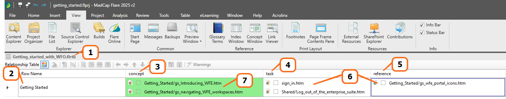

---

|Seq.# |Summary                                                       |
|:-----|:-------------------------------------------------------------|
|1     |Name of the relationship table.                               |
|2     |Row in the relationship table.|
|3     |_Concept_ topics related to the subject of the row.|                                                       
|4     |_Tasks_ topics related to the subject of the row.|
|5     |_Reference_ topics related to the subject of the row.|
|6     |By default, _different_ topic types in the same row link to one another in your output.|                                                             
|7     |To link _same_ topic types to each other, define those topics as a **Family**.|                                  

---

## <h2 id="before-you-begin">✅ Before you begin</h2>

- Ensure you have a working installation of MadCap Flare.

- Ensure you have a DITA-structured guide where each topic is one of three types: _concept_, _task_, or _reference_.

- Basic familiarity with MadCap Flare is assumed; this guide does _not_ cover introductory concepts.

!!! note
    It’s OK if your guide currently includes a **Related topics** element. After creating a relationship table, you can replace the existing element entirely or use both—keeping **Related topics** in some chapters and the relationship table in others.

---

## <h2 id="steps">📌 Steps</h2> 

To automatically and dynamically link related topics in a guide, create a relationship table. You can edit a relationship table at any time. When working in a project with multiple TOCs, create a new relationship table for each TOC.

??? note "Steps"
	[1. Add Relationship Table](#1-add-relationship-table)  
	[2. Set up your TOC](#2-set-up-your-toc)  
	[3. Create Row in the Table](#3-create-row-in-the-table)  
	[4. Add Topics to the Row](#4-add-topics-to-the-row)  
	[5. Link Same Topic Types to Each Other](#5-link-same-topic-types-to-each-other)  
	[6. Final Steps](#6-final-steps)

### 1. Add Relationship Table 

From Project Organizer, add a new relationship table.

1. From **View**, select **Project Organizer**.

2. From **Project**, right-click the **Advanced** folder and select **Add Relationship Table**.

    ---

    

    ---

3. On the **Add File** screen:

    1. Under **Source**, leave the default **New from template**. 

    2. For **File Name**, enter a filename for the relationship table. 

    3. Select **Add**.

    ---

    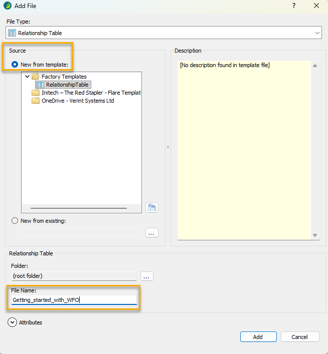

    ---

    The system saves the relationship table in the **Advanced** folder. On the right pane, you now have an empty relationship table that you can start filling in with your related topics.

    ---

    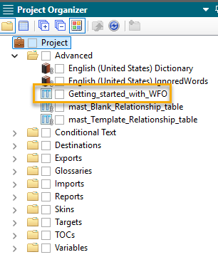

    ---
  
### 2. Set up your TOC

To easily move the topics from your TOC to your relationship table, move your TOC to appear alongside your relationship table.

1. By selecting the five lines that appear in the corner of your TOC file, click and drag your TOC.

    ---

    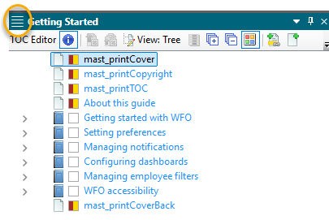

    ---

2. When you do that, Flare displays multiple shaded squares, prompting you to place the TOC in a specific location on the screen. For example, to place the TOC on the right side, select the square that is shaded on the right.

    ---

    

    ---

3. From your TOC, navigate to the chapter that includes the topics you want to add to the relationship table.

    ---

    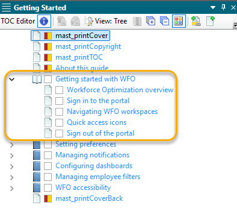

    ---

### 3. Create Row in the Table

Create the first row in your relationship table. 

1. From the **Row Name** column in your relationship table, right-click and select **Row Properties**.

    ---

    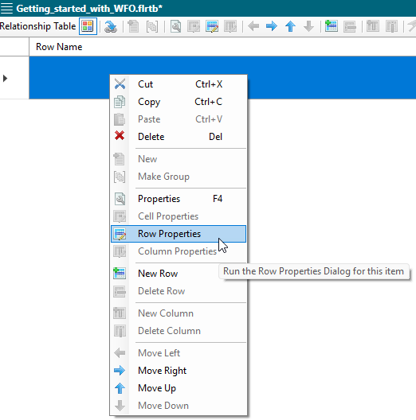

    ---

2. In the **Row Type** field, enter the name of the row (or subject), and click **OK**.  For example, I want to put links to topics related to getting up and running in an application called Workforce Optimization. Therefore, the name of my row is **Getting Started**.

    ---

    

    ---

    The system displays the name of the row in the **Row Name** column.

    ---

    

    ---

### 4. Add Topics to the Row

From your TOC, drag and drop the relevant topics to the row in your relationship table.

1. Review your TOC to determine which topics should be linked in the row.

    For example, for my **Getting Started** row, I want to link the concept topic, _Workforce Optimization overview_, with the other topics in that chapter. I also want to link the two task topics, _Sign in to the portal_ and _Sign out of the portal_, to each other.

2. Drag and drop the topics to the relevant topic type column. 

    For example:

    - Drag and drop the concept topics, _Workforce Optimization overview_ and _Navigating WFO workspaces_, to the **concept** column. 

    - Drag and drop the task topics, _Sign in to the portal_ and _Sign out of the portal_, to the **task** column. 

    - Drag and drop the reference topic, _Quick access icons_, to the **reference** column.

    ---

    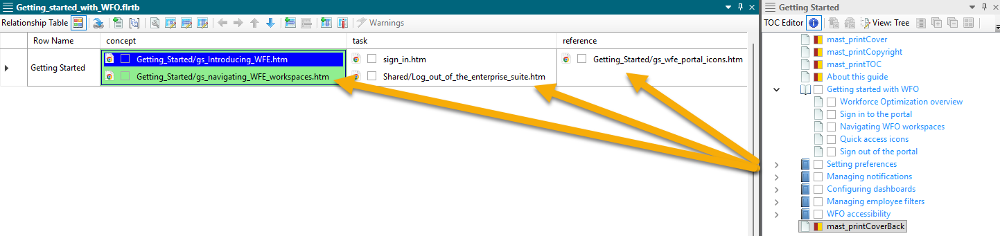

    ---

### 5. Link Same Topic Types to Each Other

By default, _different_ topic types in the same row in your relationship table will link to one another. To link topics of the _same_ topic type to each other, define them as a **Family**.

1. From the first topic to be included in the **Family**, right-click and select **Cell Properties**.

    ---

    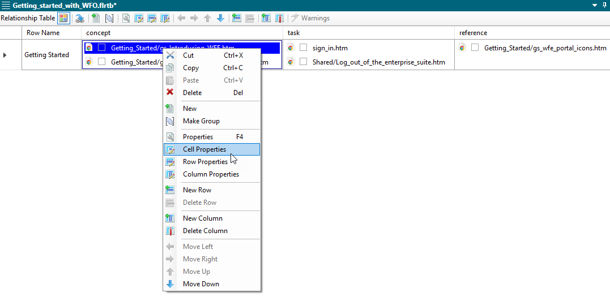

    ---

2. On the **Cell Properties** screen, from the **Collection Type** drop-down list, select **Family**.

    ---

    

    ---

3. Select **OK**.

    The cell you selected is now shaded green, indicating that there is a **Family** connection between these same topic types. Now, the concept topics, _Workforce Optimization overview_ and _Navigating WFO workspaces_, will link to one another. 

    ---

    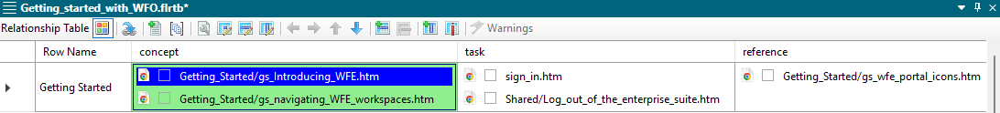

    ---

4. Repeat these steps for all topics of the same topic type that you want to link to one another.

    ---

### 6. Final Steps

Add all relevant topics to your relationship table. In addition, add your relationship table snippet to the end of all relevant topics, and update and build your target files. Then, review your output.

1. Do steps #[1](#1-add-relationship-table)-[5](#5-link-same-topic-types-to-each-other) for all rows in your relationship table.

2. Insert the relationship table snippet in every topic included in your relationship table:

    1. From a topic for which you want to add the relationship table snippet, scroll to the bottom of the topic (where your **Related topics** heading is usually inserted).

    2. Go to **Content Explorer**.

    3. From the **Content** folder, go to **Resources** and **Snippets**.

    4. From the **Snippets** folder, drag the snippet, **mast_RelTable.flsnp**, to the bottom of the topic.

    ---

    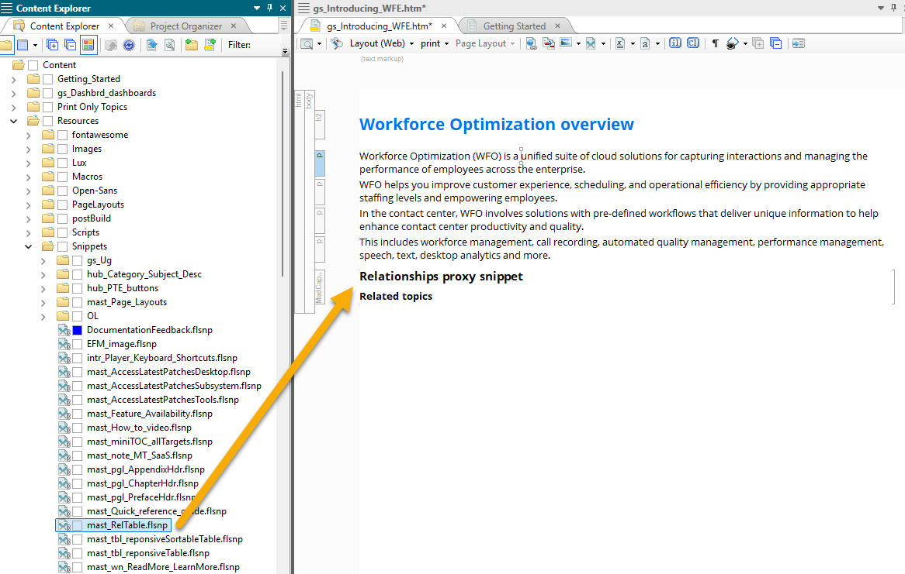

    ---

    !!! note
        If you have existing **Related topic** elements and links where you are inserting the snippets, remove those elements so they do _not_ appear in the output.

3. For every target file, from the **Relationship Table** tab, select the relationship table you created.  This ensures the relationship table links get included in the output.

    ---

    

    ---

4. Build all relevant targets.

    ---

## <h2 id="tips">💡 Tips</h2>

- For large guides, it makes sense to create a relationship table for every chapter in your guide. For smaller guides, up to 50 pages, use a single relationship table.

- Every row in a relationship table must have _at least two_ topics. If there are _only_ two topics, they either need to be of _different_ topic types or the _same_ topic type linked together as a _Family_.

- By default, all topics of different topic types in the same row link to each other. Therefore, make sure that _all_ of those topics are actually related to one another. If it does _not_ make sense to link all of them, go granular! Create another row with a more granular subject and link less topics to one another. It is better to have _less_ and _more_ directly related topic links at the end of a topic, than a ton of somewhat or not at all related topic links at the end of a topic.

- Do _not_ include chapter page .htm files in a relationship table. Chapter pages typically have their own format with a set **Related topics** snippet and your output will look messy if you add the relationship table snippet to it as well.

- Do _not_ include topics in a relationship table that are part of a workflow. The workflow topic itself has links for each step in the workflow. Including more links on top of that is confusing to the user, and takes away from the specified and directed nature of the workflow.

- When linking task topics, your output might result in the same topic link appearing under the **Before you begin** heading at the beginning of a task, and under the **Related topics** heading at the end of the same task. Although not ideal, it is okay if this happens. The benefits of using relationship tables outweigh the minor DITA infraction of having the same link twice within the same topic.

---

## <h2 id="result">✅ Result</h2>

View your output. Make sure that the related topics generated by your relationship table are what you expected.

---

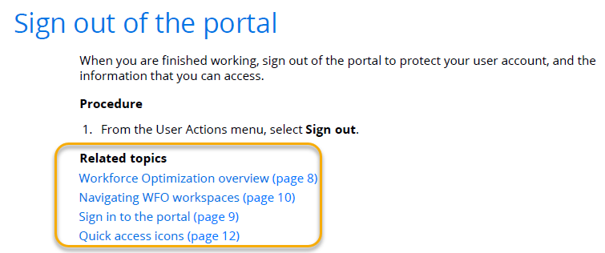

---

!!! note
    If the links are _not_ what you expected, open your relationship table, edit it, rebuild your targets, and check again. It's ok to not get it right the first time! It takes time to understand how to build the relationship tables in a way that results in the right output.

!!! info
    For more information and technical support for MadCap Flare, see [Additional resources](#additional-resources).

---

## <h2 id="additional-resources">🔗 Additional resources</h2>

- [MadCap Flare Desktop Help](https://help.madcapsoftware.com/flare2025r2/Content/Flare/Home.htm)
- [MadCap Software Support Center](https://www.madcapsoftware.com/support/)

