# Docmost User Guide
The _Docmost User Guide_ is a comprehensive guide for end users that describes a collaborative wiki platform. 

## Table of Contents
1. [Introduction to Docmost](#introduction-to-docmost)
2. [Getting started](#getting-started)
3. [Managing workspaces](#managing-workspaces)
4. [Managing spaces](#managing-spaces)
5. [Managing groups](#managing-groups)
6. [Managing pages](#managing-pages)

# Introduction to Docmost

_Docmost_ is an open-source collaborative wiki that provides easy and robust content creation and real-time collaboration.

**Topics**:

* [Overview](#overview)
* [Workspaces, spaces, and pages](#workspaces-spaces-and-pages)
* [Key features](#key-features)
* [Target audience](#target-audience)

## Overview

Docmost allows multiple users to work on the same page in real time without overwriting the content of other users. It is an open-source collaborative wiki that provides an alternative to Notion and Confluence. You can use Docmost to manage a wiki, knowledge base, or even project documentation.

Docmost allows you to create, collaborate and share knowledge with dedicated collaborators or members. Create areas of collaboration, or _Spaces_, for different teams, projects or departments with defined permission levels for each individual member or group of members. You can also publicly share specific pages, allowing anyone with a link to view them.

Using a rich text editor with built-in support for multiple diagramming tools, you can easily create highly professional and visually appealing content in Docmost. You can also import and export pages in Markdown and HTML formats.

---

---

## Workspaces, spaces, and pages

In Docmost, a **_workspace_** is the top-level entity for organizing your documentation and collaboration efforts. It includes all your content, user roles, and permissions. 

Within a workspace, you can create multiple **_spaces_**. Spaces are dedicated, organized areas within your workspace that group together pages, documents, permissions, and members by project, team, or purpose.  

Within a space, you can create and manage individual documents, or **_pages_**, which contain the content itself.

---

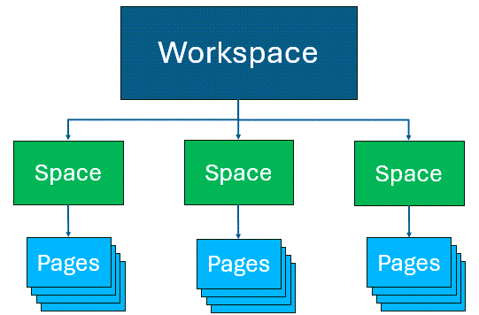

---

### Example: Workspaces, spaces, and pages

For example, you want to create a wiki that holds content related to your organization, divided by departments. 

Here's what you do:

* Create a **_workspace_** and call it the name of your organization, such as **Acme Corp**. 
* Within your workspace, create a **_space_** for each department, such as **HR**, **R&D**, and **Finance**. 
* Within each space, create **_pages_** related to the activities in the department, such as **Annual Goals**, **Dev Roadmap**, and **Planning & Analysis**.

---

---

## Key features

- **Collaborative real-time, rich text editor**: Work together with other users on the same pages in real time using a rich text editor.
- **Highly organized collaboration areas**: Create _spaces_ to organize your content by team, projects, or departments for easy and targeted collaboration.
- **Permissions management**: Control access to content by defining permission levels for individual users or groups of users, simplifying access control across your workspace.
- **History and version control**: Track all changes with a comprehensive version history, and if needed, restore past versions of pages.
- **Optimized search functionality**: Find the information you need quickly and easily with powerful search capabilities.
- **File import and export integration**: Import and export pages in Markdown and HTML formats.

## Target audience

This guide is intended for users who want to create and share content in a wiki format and collaborate with other users.

# Getting started

Set up your account for the cloud-hosted version of Docmost. Then, set up your profile and preferences.

**Topics**:

* [Set up your account](#set-up-your-account)
* [Set your profile settings and preferences](#set-your-profile-settings-and-preferences)

## Set up your account

Set up your account for Docmost, which provides you with web-based, thin client access through your browser. 

> **Note:** To install the enterprise version of Docmost, refer to the [Docmost enterprise installation instructions](https://docmost.com/docs/installation/).

**Procedure**

1. To create your workspace, go to the [Create workspace](https://app.docmost.com/create?utm_medium=installation) screen.

2. On the **Create workspace** screen, do one of the following:

    * Select **Signup with Google** and select an existing Google account.

    * Enter your name, email, and password, and select **Create workspace**.

---

---

As soon as you create your workspace, the system displays the Docmost Home screen. By default, it creates a **General** space and adds you as the first member.

---

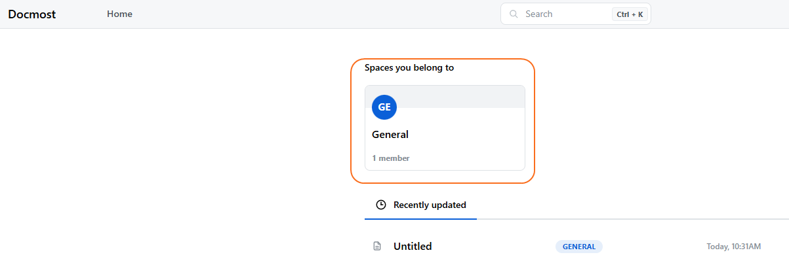

---

## Set your profile settings and preferences

After setting up your Docmost account, define your profile settings and preferences.

**Procedure**

1. From the  **My workspace** drop-down list, select **My profile**.

---

---

2. On the **My Profile** page, update or set any relevant fields.

---

---

|Field          |Description|
|:--------------|:----------| 
|Name           |Update your profile name.|
|Email          |Update your email address.|
|Password       |Update your password. |
|2-step verification |_Optional_. Select **Add 2FA method** and follow the instructions to set up the 2-step authentication method.|

3. From the  **My workspace** drop-down list, select **My preferences**.

---

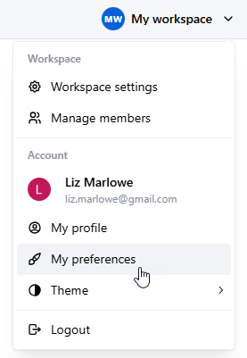

---

4. On the **My Preferences** page, complete the fields.

---

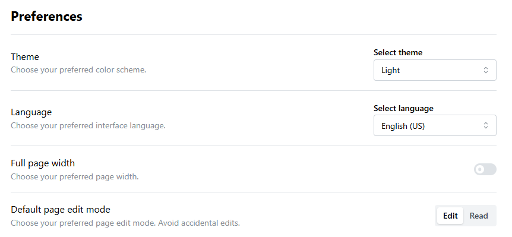

---

|Field          |Description|
|:--------------|:----------| 
|Theme          |Select the color scheme used in the application: **Light**, **Dark**, or **System settings** (default color scheme).|
|Language       |Set the language used on the user interface. Docmost supports 12 languages.|
|Full Page Width|Set the page width of the application.|
|Default page edit mode|Select one of the following: <ul><li>**Edit**: Opens every page in **Edit** mode by default.</li><li>**Read**: Opens every page in **Read** mode by default. To make any edits on a page, change the mode to **Edit**.</li></ul>

# Managing workspaces

Create and customize your _**workspace**_, which is the top-level entity for organizing your content, user roles, and permissions.  After creating your workspace, invite others to collaborate within it.

**Topics**:

* [Define workspace settings](#define-workspace-settings)
* [Invite members to a workspace](#invite-members-to-a-workspace)
* [Resend invitation to a member](#resend-invitation-to-a-member)
* [Revoke invitation to a member](#revoke-invitation-to-a-member)
* [Delete a member from a workspace](#delete-a-member-from-a-workspace)

## Define workspace settings

Customize the default workspace according to your needs. You can change the icon, name, and hostname for your workspace.

**Procedure**

1. From the  **My workspace** drop-down list, select **Workspace settings**.

---

---

2. On the **General** screen, complete the fields.

---

   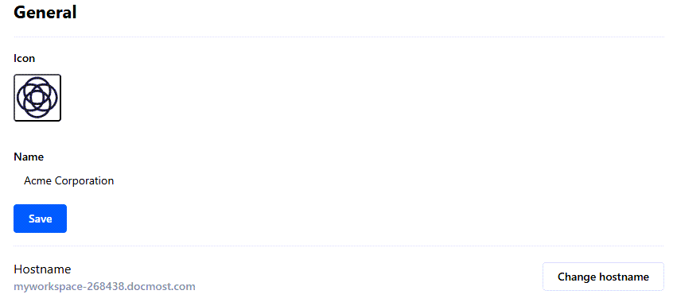

---

|Field          |Description|
|:--------------|:----------| 
|Icon           |To change the default icon, click the icon and select **Upload image**. Then, browse and select the icon you want.|
|Name           |To change the name of your workspace, edit the text in this field. For example, if you want your workspace to include content for your organization, change this value to the name of your organization.|
|Hostname       |To change your hostname, select **Change hostname**. Change the name of your hostname, and select **Change hostname** again. (You _cannot_ change the domain name, **.docmost.com**.)|

3. Select **Save**.

   The system updates your workspace settings in the application.

---

---

## Invite members to a workspace

Invite people to collaborate in your workspace. Assign the invited members to either an **Admin** or **Member** role. In addition, assign the members to groups to which you want them to have access in your workspace.

**Procedure**

1. From your workspace drop-down menu, select **Manage members**.

---

---

> 💡 **Tip:** Alternatively, from the left pane, under **Settings** and **Workspace**, select **Members**.

2. On the **Members** page, select **Invite members**.

3. On the **Invite new members** screen, complete the fields.

---

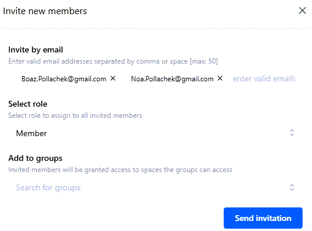

---

|Field          |Description|
|:--------------|:----------|
|Invite by email|Enter the email addresses of the people with whom you want to collaborate. After each email address, type a comma or enter a space. You can enter up to 50 email addresses.|
|Select role    |Select one of the following roles for all selected users:<ul><li>**Admin**: Can invite and delete members, edit workspace settings, manage spaces and users within the workspace, and assign roles to all members. The Admin role _cannot_ delete the workspace.</li><li>**Member**: Has access to assigned spaces and can contribute content based on specific permissions.</li></ul>|
|Add to groups |Enter the groups for which you want the invited members to have access. (If you have _not_ created any groups yet, leave this field blank. You can add members to groups at a later time.)

> 💡 **Tip:** If you want to assign different roles to different members, send one invitation for members for whom you want to assign the _same_ role. Then, send a _different_ invitation for members for whom you want to assign a _different_ role.

4. Select **Send invitation**.

   The system sends an email invite to all valid email addresses.

5. On the **Members** page, on the **Pending** tab, view all invited members who still need to accept their invitation.

---

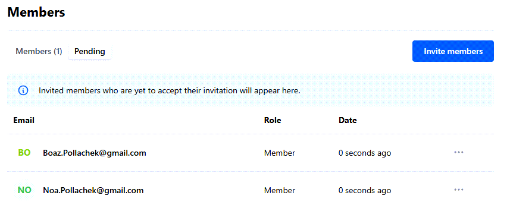

---

|Field          |Description|
|:--------------|:----------| 
|Email          |Email of the member.|
|Role           |Role or set of permissions assigned to the member (either **Admin** or **Member**). For details about **Admin** and **Member** roles, see [Invite members to a workspace](#invite-members-to-a-workspace).|
|Date           |Date when the invitation was sent. (If sent less than 24 hours ago, the system displays the amount of time passed since the invitation was sent. For example, 45 minutes ago.)|
|...            |Resend or revoke the invitation for the invited member.|

 6. On the **Members** page, on the **Members** tab, view all invited members who have accepted their invitation.

---

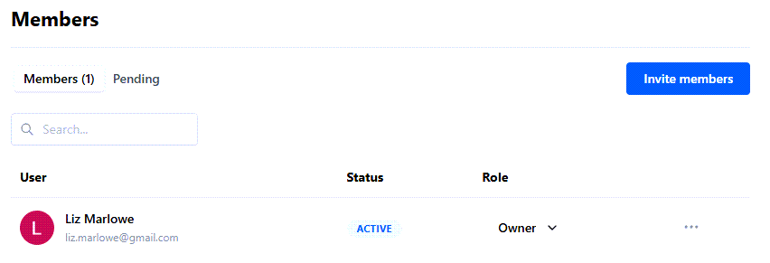

---

|Field          |Description|
|:--------------|:----------| 
|User           |Name and email of the member.
|Status         |Status of the member, which can be either **Active** or **Inactive**. **Inactive** members have _not_ logged into the workspace for at least 30 days.
|Role           |Role of the member, which can be one of the following:<ul><li>**Owner**: Can perform all operations related to the workspace, including inviting and deleting members, editing workspace settings, managing spaces and users within the workspace, assigning roles to all members, and deleting the workspace.</li><li>**Admin**: Can invite and delete members, edit workspace settings, manage spaces and users within the workspace, and assign roles to all members. The Admin role _cannot_ delete the workspace.</li><li>**Member**: Has access to assigned spaces and can contribute content based on specific permissions.</li></ul>
|...            |Deletes the member.

## Resend invitation to a member

After sending an invitation to a member, you can resend the invitation. This is helpful if you have not received a response from the member.

**Procedure**

1. From your workspace drop-down menu, select **Manage members**.

2. On the **Members** page, select the **Pending** tab.

3. For the member for whom you want to resend the invitation, click the three dots next to their name (**...**), and select **Resend invitation**.

---

---

   The system resends the invitation to the selected member.

## Revoke invitation to a member

After sending an invitation to a member, you can revoke the invitation. This is helpful if you accidentally send an invitation to the wrong person.

**Procedure**

1. From your workspace drop-down menu, select **Manage members**.

2. On the **Members** page, select the **Pending** tab.

3. For the member for whom you want to resend the invitation, click the three dots next to their name (**...**), and select **Revoke invitation**.

---

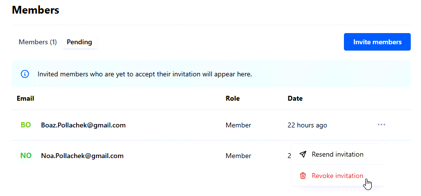

---

4. At the system prompt, select **Revoke** to confirm deleting the invitation.

   The system revokes the invitation to the selected member, and removes the invited member from the **Pending** tab.

## Delete a member from a workspace

You can delete a member from a workspace.

**Procedure**

1. From your workspace drop-down menu, select **Manage members**.

2. On the **Members** page, select the **Members** tab.

3. For the member you want to delete from the workspace, click the three dots next to their name (**...**), and select **Delete member**.

---

---

4. At the system prompt, select **Delete** to confirm deleting the member.

   The system deletes the member from the workspace. They no longer appear under the **Members** tab.
  

# Managing spaces

Create **_spaces_**, which are dedicated, organized areas within your workspace that group together documents, permissions, and collaborators by project, team, or purpose. You can add members to spaces and manage their permissions. You can also export spaces for backup, migration, or offline use.

**Topics**:

* [Create a space](#create-a-space)
* [Edit space settings](#edit-space-settings)
* [Add members to a space](#add-members-to-a-space)
* [Remove a member from a space](#remove-a-member-from-a-space)
* [Export a space](#export-a-space)
* [Delete a space](#delete-a-space)

## Create a space

Within your workspace, create a new space to group together documents, permissions, and collaborators by project, team, or purpose.

**Procedure**

1. From your workspace drop-down menu, select **Workspace settings**.

2. From the left pane, under **Settings** and **Workspace**, select **Spaces**.

3. From the **Spaces** screen, select **Create space**.

4. On the **Create space** screen, complete the fields.

---

---

|Field          |Description|
|:--------------|:----------| 
|Space name     |Enter the name of the space.  For example: **Human Resources**.|
|Space slug     |Enter the slug for the space, which identifies the page in a unique, user-friendly way.  For example: **HR**.|
|Space description |Enter the purpose of the space.  For example: **Includes pages related to annual goals, projections, new hiring requirements, and meeting minutes.**|

5. Select **Create**.

   The system creates the new space. You are now the space admin with Full Access permissions, including adding and removing members, and editing content in the space. 

---

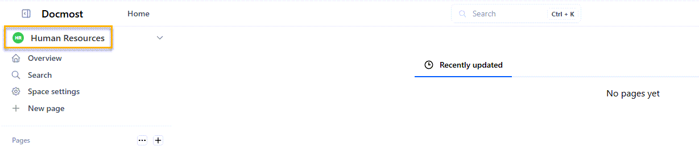

---

## Edit space settings

After creating a space, you can edit a space's settings.

**Procedure**

1. From your workspace drop-down menu, select **Workspace settings**.

2. From the left pane, under **Settings** and **Workspace**, select **Spaces**.

3. On the **Spaces** screen, select the space for which you want to edit settings.

---

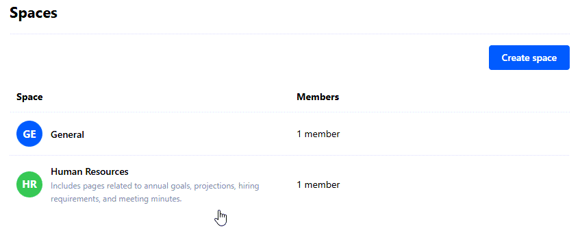

---

4. On the following screen, select the **Settings** tab.

5. From **Settings**, update the **Icon**, **Name**, **Slug**, or **Description** fields. 

   For more information on these fields, see [Create a space](#create-a-space).

---

---

6. Select **Save**.

   The system updates the settings.

## Add members to a space

Add individual members to a space for collaboration. Set specific permission levels for each member.

> 💡 **Tip:** If you want to add multiple users to a space simultaneously, [create a group](#create-a-group) and then [add the entire group as a space member](#grant-group-access-to-a-space).

**Procedure**

1. From your workspace drop-down menu, select **Workspace settings**.

2. From the left pane, under **Settings** and **Workspace**, select **Spaces**.

3. On the **Spaces** screen, select the space for which you want to add members.

---

---

4. On the following screen, select the **Members** tab. 

5. From **Members**, select **Add space members**.

6. On the **Add space members** screen, complete the fields.

---

---

|Field          |Description|
|:--------------|:----------| 
|Add Members    |Search for and select the users you want to add as members to the space.|
|Select role    |Select the role or set of permissions you want for the selected members:<ul><li>**Full access**: Has full access permissions to all space settings and pages.</li><li>**Can edit**: Can create and edit pages in the space.</li><li>**Can view**: Can view pages in the Space but _cannot_ edit them.</li></ul> |

8. Select **Add**.

   The system adds the selected users as members to the space with the defined role. 

> 💡 **Tip:** If you want to assign different roles to different members, complete these steps for members for whom you want to assign the _same_ role. Then, repeat these steps for members for whom you want to assign a _different_ role. 

## Remove a member from a space

You can remove a member from a space.

**Procedure**

1. From your workspace drop-down menu, select **Workspace settings**.

2. From the left pane, under **Settings** and **Workspace**, select **Spaces**.

3. On the **Spaces** screen, select the space from which you want to remove a member.

---

---

4. On the following screen, select the **Members** tab.

5. For the member you want to remove from the space, click the three dots next to their name (**...**), and select **Remove space member**.

---

---

6. At the system prompt, select **Remove** to confirm removing the member from the space.

   The system removes the member from the space. They no longer appear under the **Members** tab.

## Export a space

You can export a space in both Markdown and HTML formats for backup, migration, or offline use. Exporting a space allows you to have external access to all content within a space, including all pages and attachments.

**Procedure**

1. From your workspace drop-down menu, select **Workspace settings**.

2. From the left pane, under **Settings** and **Workspace**, select **Spaces**.

3. On the **Spaces** screen, select the space you want to export.

---

---

4. On the following screen, select the **Settings** tab.

5. From the **Export space** section on this screen, select **Export**.

---

---

6. On the **Export space** screen, complete the fields.

---

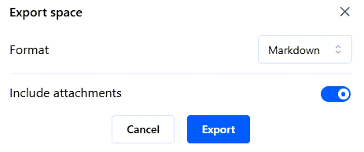

---

|Field          |Description|
|:--------------|:----------| 
|Format         |Select the format in which you want to export the space: either **Markdown** or **HTML**.|
|Include attachments |To include all attachments in the space in the exported file, move the toggle to the **On** position.|

7. Select **Export**.

8. Save the .zip file locally.

   Your exported file has been saved successfully.

## Delete a space

If you no longer need a space, you can delete it. For example, you created a space for a small group of members and they have merged into a bigger group that belongs to a different space.

:warning: **Deleting a space permanently removes all pages, comments, attachments and permissions associated with the space. You _cannot_ undo this action.**

**Procedure**

1. From your workspace drop-down menu, select **Workspace settings**.

2. From the left pane, under **Settings** and **Workspace**, select **Spaces**.

3. From the **Spaces** screen, select the space you want to delete.

---

---

4. On the following screen, select the **Settings** tab.

5. From the **Delete space** section on this screen, select **Delete**.

---

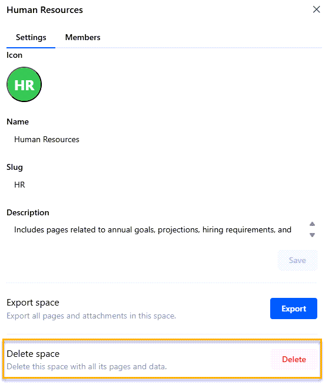

---

6. At the system prompt, type the name of the space you want to delete and select **Confirm** to delete the space.

   The system deletes the space, including all of its pages, comments, attachments, and permissions.

# Managing Groups

Create **_groups_**, which allow you to manage user permissions for multiple users simultaneously. Instead of assigning roles and privileges to individual users, assign them to a group, simplifying access control across your workspace.

All users are assigned to a default group called **Everyone**.

> [!NOTE]
> Only users with **Admin** or **Owner** roles can create, edit, and delete groups.

**Topics**:

* [Create a group](#create-a-group)
* [Edit group settings](#edit-group-settings)
* [Grant group access to a space](#grant-group-access-to-a-space)
* [Add a member to a group](#add-a-member-to-a-group)
* [Remove a member from a group](#remove-a-member-from-a-group)
* [Delete a group](#delete-a-group)

## Create a group

Create a group to manage user permissions for multiple users simultaneously.

**Procedure**

1. From your workspace drop-down menu, select **Workspace settings**.

2. From the left pane, select **Groups**.

3. From **Groups**, select **Create group**.

4. On the **Create group** screen, complete the fields.

---

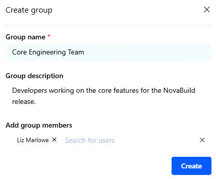

---

|Field          |Description|
|:--------------|:----------| 
|Group name     |Enter the name of the group.  For example: **Core Engineering Team**.|
|Group description| Enter a description for the group.  For example: **Developers working on the core features for the NovaBuild release.**|
|Add group members|Search for and enter the members you want to add to the group.  You can also add members at a later time.|

5. Select **Create**.

   On the **Manage Group** screen, the system displays the group.

---

---

## Edit group settings

After creating a group, you can edit the group's name and description. This is helpful if the name or purpose of the group changed after you created it.

**Procedure**

1. From your workspace drop-down menu, select **Workspace settings**.

2. From the left pane, select **Groups**.

3. From **Groups**, select the group you want.

4. On the **Manage Group** screen, from the three dots (...) on the top right, select **Edit group**.

---

---

5. On the **Edit group** screen, update the **Group name** and **Group description** fields and select **Save**.

---

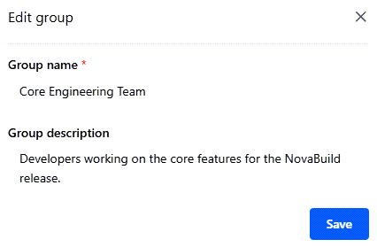

---

The system saves your updates.

## Grant group access to a space

Instead of adding _individual_ members to a space, you can add _groups_. Assign a specific set of permissions to the entire group. Groups make it easy to grant multiple users access at the same time. In addition, creating groups ensures members have the correct permissions for working in the space.

**Procedure**

1. From your workspace drop-down menu, select **Workspace settings**.

2. From the left pane, under **Settings** and **Workspace**, select **Spaces**.

3. On the **Spaces** screen, select the space for which you want to grant group access.

4. From the **Members** tab, select **Add space members**.

5. On the **Add space members** screen, complete the fields.

---

---

|Field          |Description|
|:--------------|:----------| 
|Add members    |Search for and select the group to which you want to grant access to the space.|
|Select role    |Select one of the following permission levels:<ul><li>**Full access**: Has administrative access to all space settings and pages, and full editing privileges.</li><li>**Can edit**: Can create and edit pages in the space, but _cannot_ access space settings.</li><li>**Can view**: Can view all page content but _cannot_ edit any content.</li></ul>

6. Select **Add**.
   
   The system adds the group as a member to the space.

---

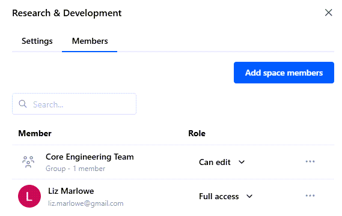

---

>[!NOTE]
> If a user has been added as an individual member _and_ as a group member to the _same_ space with _different_ permission levels, the highest permission level applies. For example,  Alex Smith has been added as a member to the space, **Research & Development**, with **Can View** permissions. Alex has also been added to the group, **Core Engineering Team**, which has **Can Edit** permissions to this space. Therefore, Alex has edit privileges for this space. 

## Add a member to a group

After creating a group, you can easily add a member to the group.

**Procedure**

1. From your workspace drop-down menu, select **Workspace settings**.

2. From the left pane, select **Groups**.

3. From **Groups**, select the group you want.

4. On the **Manage Group** screen, select **Add group members**.

5. From the **Add group members** field, search for and enter the users you want to add to the group.

6. Select **Add**.

---

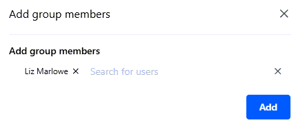

---

The system adds the member to the group.

## Remove a member from a group

If needed, you can easily remove a member from the group.

**Procedure**

1. From your workspace drop-down menu, select **Workspace settings**.

2. From the left pane, select **Groups**.

3. From **Groups**, select the group you want.

4. On the **Manage Group** screen, find the member you want to remove.

5. From the three dots (**...**) next to their name, select **Remove group member**.

---

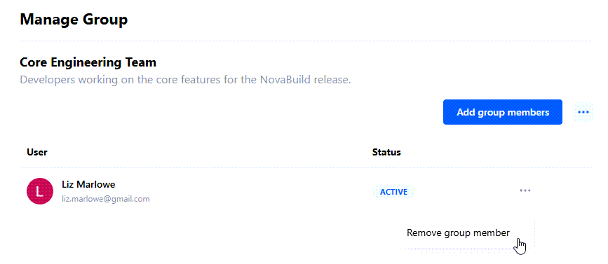

---

6. To confirm removing the member from the group, select **Delete**.

   The system removes the member from the group.

## Delete a group

If needed, you can delete a group.

**Procedure**

1. From your workspace drop-down menu, select **Workspace settings**.

2. From the left pane, select **Groups**.

3. From **Groups**, select the group you want to delete.

4. On the **Manage Group** screen, from the three dots (...) on the top right, select **Delete group**.

---

---

5. To confirm deleting the group, select **Delete**.

   The system deletes the group.

# Managing pages

Within a space, create and manage individual documents, or **_pages_**, which contain the content itself. Each page contains specific content for the space, such as a department's budget, project roadmap, or annual goals.

**Topics**:

* [Create a page](#create-a-page)
* [Move a page to a different space](#move-a-page-to-a-different-space)
* [Copy a page to a different space](#copy-a-page-to-a-different-space)
* [Duplicate a page to the same space](#duplicate-a-page-to-the-same-space)
* [Import a page](#import-a-page)
* [Export a page](#export-a-page)

## Create a page

Create a page, which contains content within a space. For example, for the _Human Resources_ space, create a page that describes the department's annual goals.

**Procedure**

1. From the Home page, select the space for which you want to create a page.

---

---

2. From the left pane, select **+ New page**. 

---

---

3. On the new page, type a title for the page, such as **Annual Goals**.

4. Add content to the page. 

   You can use the editing bar to apply headings, alignment, text formatting, links, and comments.  

---

---

5. Once you have added content, you can share the page with other members of the space, manage comments, and do other actions related to the page (including but not limited to _move_, _export_, _print_, and _view page history_).

---

---

|Number|Description|
|:-----|:----------| 
|1     |Sets the page edit mode, as described in [Set your profile settings and preferences](#set-your-profile-settings-and-preferences).
|2     |Shares the page with other members of the space.
|3     |Displays the **Comments** pane.
|4     |Displays the Table of Contents of the page (defined by applied headings).
|5     |Provides additional options, including: <ul><li>**Copy link**: Copies the link to the page for sharing with other users.</li><li>**Full width**: Toggles to the full page width.</li><li>**Page history**: Displays a history of page versions.</li><li>**Move**: Moves the page to another space.</li><li>**Export**: Exports the page to an external file.</li><li>**Print PDF**: Prints a PDF of the page.</li><li>**Move to trash**: Deletes the page (moves to trash).</li></ul>  
|6     |Displays **Open** and **Resolved** comments on the page.
|7     |Allows you to **Edit**, **Resolve**, and **Delete** comments on the page.

## Move a page to a different space

You can easily move a page to a different space. This is helpful if the content on the page is more suitable for a different space. 

**Procedure**

1. From the Home page, select the space that contains the page you want to move.

2. From the list of pages displayed in the space, select the page you want to move.

3. From the left pane, hover over the page, select the three dots, and select **Move**.

---

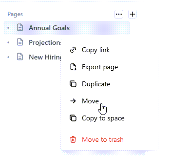

---

4. From **Move page**, select the space to which you want to move the page and select **Move**.

---

---

   The system moves the page to the selected space.

## Copy a page to a different space

You can easily copy a page to a different space. This allows you to include the same content in multiple spaces, if needed.

**Procedure**

1. From the Home page, select the space that contains the page you want to copy.

2. From the list of pages displayed in the space, select the page you want to copy.

3. From the left pane, hover over the page, select the three dots, and select **Copy to space**.

---

---

4. From **Copy page**, select the space to which you want to copy the page and select **Copy**.

---

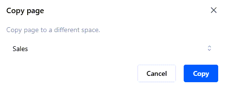

---

   The system copies the page to the selected space.

## Duplicate a page to the same space

You can duplicate a page to the same space. This is helpful if you want to create a page that is similar to an existing page with modifications. Duplicate the page, and then modify the duplicated page as needed.

**Procedure**

1. From the Home page, select the space that contains the page you want to duplicate.

2. From the list of pages displayed in the space, select the page you want to duplicate.

3. From the left pane, hover over the page, select the three dots and select **Duplicate**.

---

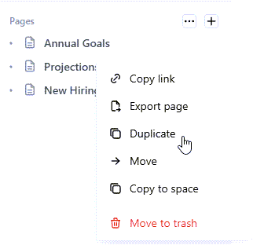

---

   The system duplicates the page in the same space, naming it: **Copy of {page name}**. For example, if you duplicated a page called **Annual Goals**, the duplicated page is named: **Copy of Annual Goals**.

---

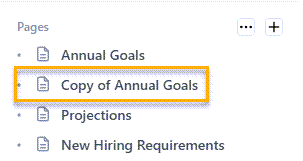

---

## Import a page

You can import pages to a specific space in HTML and Markdown formats. You can also import pages from Notion and Confluence. This allows you to add pages sourced from external content in your space, and share the content with all space members.

**Procedure**

1. From the Home page, select the space for which you want to import a file.

2. From the left pane, hover over the **Pages** heading, select the three dots, and select **Import pages**.

---

---

3. From **Import pages**, select the type of page you want to import:

   - **Markdown**: Imports a page in Markdown format.

   - **HTML**: Imports a page in HTML format.

   - **Notion**: Imports a Notion page.

   - **Confluence**: Imports a Confluence page.

4. Select **Upload file**, and select the page you want to upload (in the selected format).

---

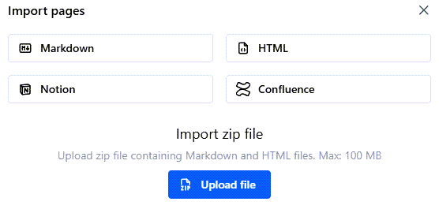

---

   The system imports the file into the selected space.

## Export a page

You can export a page in either Markdown or HTML format for external use. You can select whether to include all subpages and attachments in the exported file.

**Procedure**

1. From the Home page, select the space for which you want to export a page.

2. From the list of pages displayed in the space, select the page you want to export.

3. From the left pane, hover over the page, select the three dots, and select **Export page**.

---

---

4. On **Export page**, complete the fields.

---

---

|Field       |Description|
|:-----------|:----------| 
|Format      |Select whether to export the file in **Markdown** or **HTML** format.|
|Include subpages |To include all subpages in the exported file, toggle this setting to the **On** position.|
|Include attachments |To include all attachments in the exported file, toggle this setting to the **On** position.|

5. Select **Export**.

6. Save the exported file as a .zip file in the selected location.

