# Taiga User Guide
The _Taiga User Guide_ is a comprehensive guide for Agile project managers that describes an Agile project management tool.

---

# Introduction to Taiga { data-toc-label="Introduction to Taiga" }

_Taiga_ is an open-source project management tool with an intuitive interface and comprehensive support for Agile methodologies, including Scrum and Kanban.

**Topics**:

* [Overview](#overview)
* [Taiga deployment options](#taiga-deployment-options)
* [Key features](#key-features)
* [Target audience](#target-audience)

## Overview

Taiga helps project managers organize, track, and prioritize work using Agile methodologies, including Scrum and Kanban frameworks. As a powerful alternative to Jira or Trello, Taiga helps teams define deliverables, align priorities, and maintain transparency across ongoing activities and resource allocation.

Using Taiga, you can easily manage daily standups with your team. Create user stories that capture all required tasks, and include attachments, story points, internal requirements, client requests, and dependencies. Generate individual or bulk tasks and drag them into clear status swim lanes on the Sprint Taskboard. Story points, due dates, and blocked tasks are prominently displayed, making it simple to track high-priority items and assist team members facing blockers.

As Taiga offers robust customization options, you can easily configure and customize epics, user stories, tasks, issue workflows, custom fields, role permissions, integrations, and plugins. Create a project wiki for documentation and other content. To encourage team collaboration and engagement, highlight team member skills and contributions on the unique team board, such as highlighting a _Bug Hunter_ for issue reporting. In addition, use Taiga's powerful search capabilities to find any type of data across your project.

---

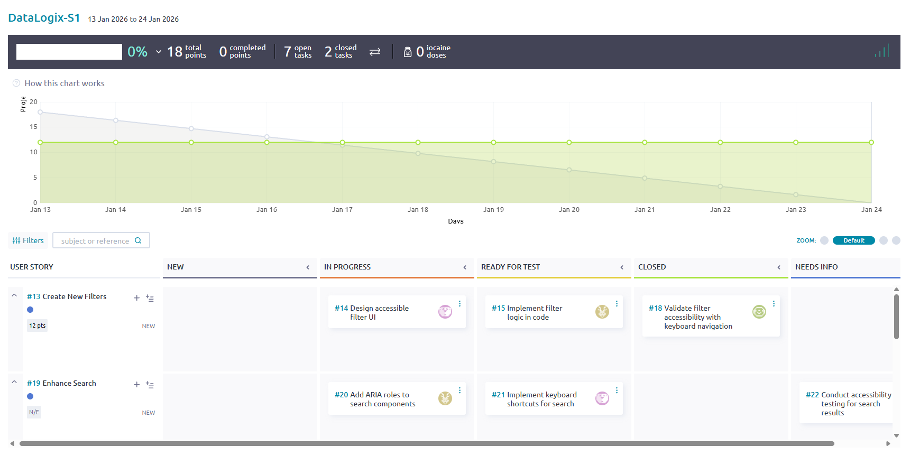

--- 

## Taiga deployment options

When choosing the best deployment option, consider your team’s size, familiarity with Linux and Docker, and the required level of technical support.

There are two main types of deployment options:

- **Taiga Cloud deployment**: Download and install the Cloud-based version from [Taiga's website](https://taiga.io/ "Taiga's website"). 

    The **Taiga Cloud Basic** deployment is free. For technical support, tap into the wealth of help articles, troubleshooting tips, and FAQs on the [Taiga Community page](https://community.taiga.io/ "Taiga Community page"). For dedicated, hands-on support from Taiga, purchase **Taiga Cloud with Premium Support** for $70 per month. 

---

---

- **Taiga Self-hosted deployment**: Host Taiga on your own or using a third-party platform with varying levels of support.

    If you or members of your team have Linux and Docker experience and you want to host Taiga on your own platform, the **Self-Managed** hosted deployment is for you. It is free, ideal for teams of less than 10 people, and provides an easy self-download, installation, and upgrade process. 

    For a minimal fee of $10 per month and for teams of less than 20 people, the **Automated-Hosting** option is optimal, providing a fully managed download, installation and upgrade process, and enterprise-grade security. 

    For larger teams of more than 25 people and for premium support, check out the **Managed for You** option. Install this version behind your own firewall and VPN. Installation and upgrades are fully managed and supported.

---

---

> **Note:** For updated pricing information for all deployment options, see [Taiga's website](https://taiga.io/ "Taiga's website").

## Key features

- **Intuitive project management tool for Agile methodologies**: Organize, track, and prioritize work based on Agile entities using a user-friendly, intuitive user interface.
- **Daily team stand-up management**: Drag and drop stories and tasks into clear status swim lanes on a Sprint Taskboard or Kanban board.
- **Detailed, granular Agile entity creation**: Create user stories with attachments, story points, internal requirements, client requests, and dependencies. Create tasks with attachments, due dates, and priorities.
- **High visibility of urgent and blocked work**: Urgent and blocked tasks and stories are clearly marked, making it simple to track high-priority items and assist team members facing blockers.
- **Customizable Agile entities**: Customize epics, user stories, tasks, issue workflows, custom fields, role permissions, integrations, and plugins.
- **Wiki content management**: Add content to a wiki, including documentation, specs, and out-of-the-box project information.
- **Team collaboration and engagement**: Highlight team member skills and contributions on the unique Team page, such as nominating a _Bug Hunter_ for issue reporting.

## Target audience

This guide is intended for project managers and team leads who manage work using Agile methodologies, including Scrum and Kanban frameworks.

# Getting started { data-toc-label="Getting started" }

Create your account for the Taiga Cloud Basic deployment option. Then, set up your first project in Taiga.

**Topics**:

* [Create your account](#create-your-account)
* [Create a project](#create-a-project)

## Create your account

Create your account using the Taiga Cloud Basic deployment option.

> **Note:** For more information about other types of deployment options, see [Taiga deployment options](#taiga-deployment-options).

**Procedure**

1. To create your Taiga account, go to the [Taiga register account page](https://tree.taiga.io/register).

2. On the [Taiga register account page](https://tree.taiga.io/register), complete the fields.

> 💡 **Tip:** Alternatively, you can log in with GitHub or GitLab.

---

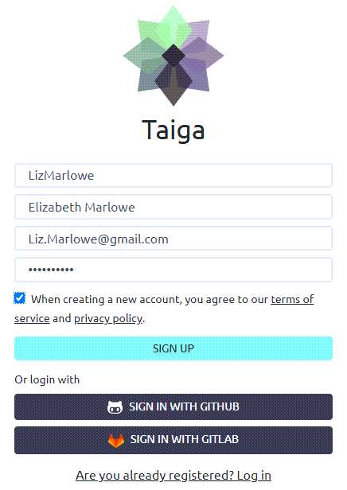

---

|Field             |Description|
|:-----------------|:-----------------------|
|Name              |Enter your username.    |
|Full Name         |Enter your first and last name.|
|Email             |Enter your email address. |
|Password          |Enter a unique password. |
|When creating a new account, you agree to your terms of service and privacy policy.| Select this setting.|

3. Select **Sign Up**.

   After you create an account, you can create your first [project](#create-a-project). 

## Create a project

Create a _project_, which is the top-level container for organizing your team's work. For example, in a Scrum environment, a project can contain all of your epics, stories, tasks, and issues related to a specific software release.

You can create a Scrum or Kanban project. You can also copy an existing project and modify as required, or import a project from Taiga or other platforms (including Jira, Github, Trello, or Asana).

**Before you begin**

[Create your account](#create-your-account)

**Procedure**

1. From the [Taiga](https://tree.taiga.io/) home page, select **New Project**.

---

---

2. On the **Create Project** screen, select the type of project you want to create.  

   To get more information about Scrum and Kanban, select the information icon 
    next to each option.

---

---

|Project Type |Description|
|:-----------------|:-----------------------|
|Scrum             |Create a Scrum project, which is an iterative and incremental Agile software development methodology for managing product development.  Scrum allows you to prioritize and solve your tasks in short time cycles. All work is managed in the product backlog, which contains tasks that are prioritized according to when the work needs to be delivered.  Product backlogs are broken down into manageable, specific periods of time called sprints. Each sprint contains specific user stories from the backlog that need to be delivered by the end of that sprint. The project advances as the backlog becomes depleted.    |
|Kanban            |Create a Kanban project, which is a workflow-based Agile software development methodology for managing product development.  Kanban allows you to divide project development into stages. Work is managed on Kanban cards, like index cards or post-it notes, where each card details every task or user story that needs to be completed. The Kanban board is used to track progress by moving each card from one stage to the next.
|Duplicate Project |Copy an existing project and modify as required.
|Import Project    |Import a project from Taiga or other platforms (including Jira, Github, Trello, or Asana).

3. If you selected **Scrum**, **Kanban**, or **Duplicate Project**, enter your project details.

> **Note:** If you selected **Duplicate Project**, select the project you want to duplicate, and then enter your project details. If you selected **Import Project**, select the platform of the project you want to import and browse and select the project to import.

---

---

|Field |Description|
|:-----------------|:-----------------------|
|Project Name      |Enter a unique name for your project.|
|Project Description |Enter a description for your project, which can include the type of entities the project will include (epics, stories, tasks, etc.) the target software release, and even details about the team members.
|Public Project / Private Project |Select whether the project is open to all users (**Public**) or just the project's team members (**Private**).  The number of public projects you can create is determined by your [Taiga subscription plan](#taiga-deployment-options). For more information, see [What's the difference between public and private projects?](https://community.taiga.io/t/whats-the-difference-between-public-and-private-projects/139)

4. Select **Create Project**.

   The system creates the new project. From here, you can start populating your project with stories, tasks, and issues.  For example, if you selected a Scrum project, you can start creating user stories for your product backlog (see [Create a user story](#create-a-user-story)).

---

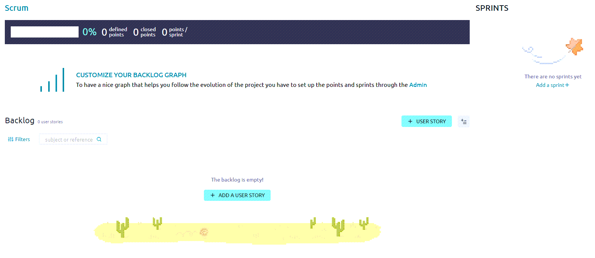

---

> 💡 **Tip:** Before creating your user stories, you might find it useful to define your project settings, including adding team members to your project, customizing specific Agile entities (such as custom fields and adding new story points), and defining project modules and roles. If that is your preferred workflow, see [Defining project settings](#defining-project-settings).

# Defining project settings { data-toc-label="Defining project settings" }

Define specific settings for your project, including updating project details, adding team members to the project, defining role permissions, and customizing specific Taiga attributes.

> **Note:** For portfolio purposes, this section includes a curated list of tasks.

**Topics**:

* [Update project details](#update-project-details)
* [Add new members](#add-new-members)
* [Define role permissions](#define-role-permissions)
* [Create a custom field](#create-a-custom-field)
* [Add a new issue type](#add-a-new-issue-type)

## Update project details

Update existing project settings (such as name, description, logo, owner, and public/private status). The fields are the same as during creation unless noted. For first-time setup, see [Create a project](#create-a-project). The items below call out update-only behaviors and additional options.

**Before you begin**

[Create a project](#create-a-project)

**Procedure**

1. From the [Taiga](https://tree.taiga.io/) home page, under **My projects**, select the project you want.

2. On the project page, from the left sidebar, select **Settings**.

3. From the **Project** tab, select **Project Details**.

4. On the **Project details** page, update any relevant fields.

---

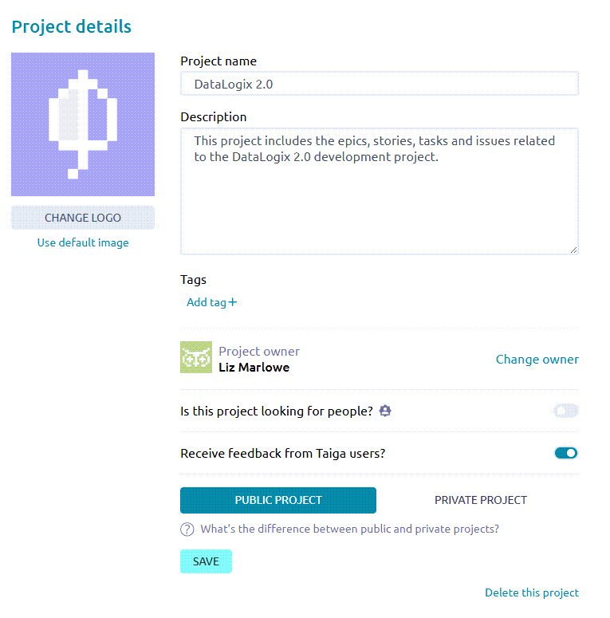

---

| Field                                | Notes When Updating                                                                                 |
|:-------------------------------------|:--------------------------------------------------------------------------------------------------------|
| Project Name                         | Rename the project. (Same field as during creation.)                                                    |
| Project Description                  | Update the description. (Same field as during creation.)                                                |
| Tags                                 | Add tags to group, filter, and organize projects. Tags appear on the dashboard for quick scanning.      |
| Project Owner                        | Reassign ownership to another team member.                                                              |
| Is this project looking for people?  | Toggle **On** to advertise you’re seeking teammates and specify desired profiles/skills.                |
| Receive feedback from Taiga users?   | Toggle **On** to allow feedback from the broader Taiga community.                                       |
| Public Project / Private Project     | Change visibility. For limits on public projects, see [Taiga deployment options](#taiga-deployment-options). |

For field definitions shown during project creation (such as visibility and description), see [Create a project](#create-a-project).

5. Select **Save**.

   The application saves your updates.

> **Note:** If needed, you can also delete the project from this screen.

## Add new members

Add new members whom you want to contribute to your project. Typically, this includes people who have the skills and experience to do the stories and tasks you created (or plan on creating) in the backlog. It can also include managers, like a scrum master, who manages the team.

**Procedure**

1. From the [Taiga](https://tree.taiga.io/) home page, under **My projects**, select the project you want.

2. On the project page, from the left sidebar, select **Settings**.

3. Select the **Members** tab.

4. Select **+ New Member**.

---

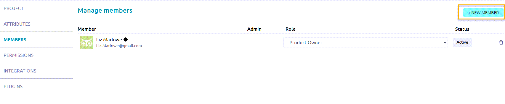

---

5. Enter the email address of the new member and select the  icon.

6. On the **New Member** screen, select the role of the new member (such as **UX**, **Design**, **Front**, **Back**, **Product Owner**, and **Stakeholder**).

---

---

7. _Optional_. Add a personalized text to the invite that will be sent to the new member. For example: _Welcome to the DataLogix 2.0 project! We are excited to invite you as a new member to contribute to this project. Looking forward to working with you!_

---

---

8. Select **Invite**.

   If users are already registered on Taiga, they will be added automatically to the project. Otherwise, they will receive an email invitation. On the **Manage members** screen, a row is added listing their name, email address, and assigned role with a **Pending** status. You can resend the invitation to any member with a **Pending** status.

---

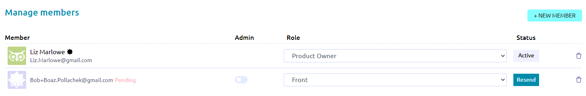

---

9. Repeat steps 4-8 for all new members you want to invite to the project.

   When members have accepted the invite (or are added automatically), their status is changed to **Active**. If needed, you can change their role or enable them with admin permissions.

---

---

> **Note:** If needed, you can delete members from this screen by selecting the **Delete member** icon.

## Define role permissions

You can update the default permissions for defined roles (including **Design**, **Front**, **Back**, **Product Owner**, **Stakeholder**, and **External User** roles). In addition, you can create new roles and define specific permissions for these roles.

Role permissions help control who can create, edit, or delete Agile entities, such as stories, tasks, and sprints.

**Procedure**

1. From the [Taiga](https://tree.taiga.io/) home page, under **My projects**, select the project you want.

2. On the project page, from the left sidebar, select **Settings**.

3. Select the **Permissions** tab.

4. To update the default permissions for a defined role, select the role (such as **Design**, **Front**, **Back**, etc.).

---

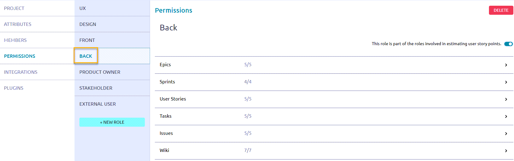

---

5. On the **Permissions** page, complete the fields.

---

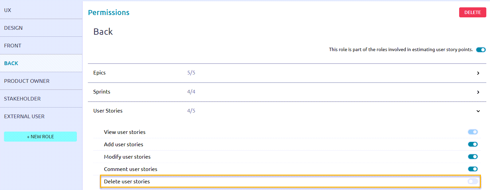

---

|Field |Description|
|:-----------------|:-----------------------|
|This role is part of the roles involved in estimating user story points.|Do one of the following:<ul><li> To allow the role to be involved in estimating user story points, toggle this setting to the **On** position.</li><li>If you do _not_ want the role to be involved in estimating user story points, toggle this setting to the **Off** position. |
|Agile entities (**Epics**, **Sprints**, **User Stories**, **Tasks**, etc.)|To update the permissions for this role for a specific entity, select the entity.  For example, select **User Stories**.|
|Permissions                  |Enable or disable the relevant permissions by toggling the settings to the **On** or **Off** positions.  For example, for the **Back** role, toggle the setting, **Delete user stories**, to the **Off** position. As a result, the member assigned to the **Back** role will not be able to delete user stories in the project.|

6. To set specific permissions for any user, including search engines, select the **External User** role and update permissions accordingly.

7. To create a new role, select **+ New Role** and set permissions for the new role.

## Create a custom field

When creating a new Agile entity in Taiga (such as an epic, user story, or task), there are default fields that define the entity. For example, when creating a new user story, some of the default fields include **Subject**, **Description**, and **Points**. To customize these entities for your project, you can add custom fields.

**Procedure**

1. From the [Taiga](https://tree.taiga.io/) home page, under **My projects**, select the project you want.

2. On the project page, from the left sidebar, select **Settings**.

3. From the **Attributes** tab, select **Custom Fields**.

---

---

4. For the entity for which you want to add a custom field, complete the fields.

---

---

|Field |Description|
|:-----------------|:-----------------------|
|Name              |Enter the name of the custom field.  For example, if you are adding a field for acceptance criteria for user stories, enter: **Acceptance Criteria**|
|Description       |Enter a description for the custom field.  For example, for **Acceptance Criteria**: _Set of clear, measurable conditions that a user story must satisfy to be considered complete and accepted by the product owner or stakeholders._ |
|Type              |Select the valid input type for the field.  Valid values include: **Text**, **Multi-line**, **Rich text**, **Date**, **URL**, **Dropdown**, **Checkbox**, **Number**.|

5. To save your changes, hover over the row and select **Update custom field**.

6. To edit or delete the custom field, after you save it, hover over the row again and select one of the following icons: 
   
   -  **Edit custom field**
 
   -  **Delete custom field** 

---

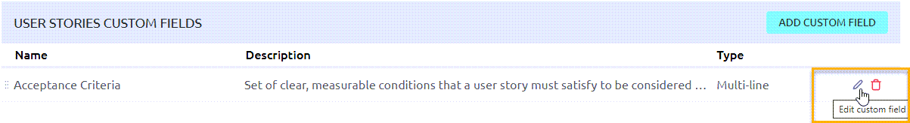

---

## Add a new issue type

By default, the types of issues included in a project include **Bug**, **Question**, and **Enhancement**. You can add new issue types to your project, as required. 

For example, you might want to add an issue type that is related to work that is dependent on another member or team. For this purpose, you can add a new issue type called **Dependency**.

**Procedure**

1. From the [Taiga](https://tree.taiga.io/) home page, under **My projects**, select the project you want.

2. On the project page, from the left sidebar, select **Settings**.

3. From the **Attributes** tab, select **Types**.

---

---

4. On the **Types** page, select **Add New**.

5. In the new row that appears:

   1. In the **Color** field, select a color that identifies the issue type. (Alternatively, enter the hexadecimal color code.)

   2. In the **Name** field, enter a name for the new issue type.

6. To save your changes, hover over the row and select the checkmark.

---

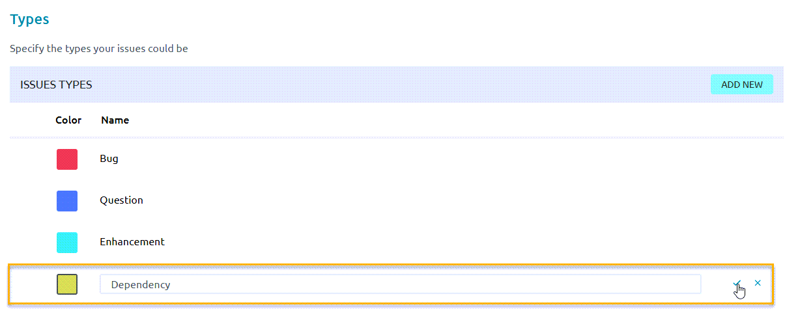

---

# Scrum project workflow { data-toc-label="Scrum project workflow" }

In Scrum, work typically moves through two main phases: 

- _Backlog Management_: Prepare and prioritize work by creating and refining epics, user stories and tasks. 

- _Sprint Execution_: Create and plan sprints, assign stories and tasks to members, and track story and task progress through to completion.

---

---

The following table summarizes each step in the workflow.

|Seq.#             |Step                    |Phase             |Description              | Example                         |
|:-----------------|:-----------------------|:-----------------|:------------------------|:--------------------------------|
|1                 |**[Create epics](#create-an-epic)**        |Backlog Management |Create _epics_, which group related user stories. Together, the user stories in an epic encapsulate work towards a specific product development.| An epic called _User Management Accessibility Redesign_ includes user stories that define development related to accessibility features in the User Management application.             
|2                 |**[Create user stories](#create-a-user-story)**      |Backlog Management      |Within an epic and from the backlog, create _user stories_ that define specific development needed to accomplish the goal of the epic.| In the epic called _User Management Accessibility Redesign_, there's a user story called _Change UI Labels_, which defines changing the UI text headings to comply with WCAG requirements.
|3                 |**[Create tasks](#create-a-task)**             |Backlog Management      |Within each user story, create _tasks_, which break up the story work into smaller, manageable chunks that different members of the team can work on. | For the user story, _Change UI Labels_, there are 3 tasks: _Propose New UI Labels_, _Update Text Labels in DB_, and _Test New UI Labels_. Each task is assigned to a different member of the team.|
|4                 |**[Create a sprint](#create-a-sprint)**           |Sprint Execution        |Create a _sprint_, a timeboxed period for completing user stories. Typically, multiple sprints are created well in advance of their start dates.| A sprint called _DLogix-S1_ is a two-week sprint, starting on 1/12 and ending on 1/19.|
|5                 |**[Assign user stories to a sprint](#assign-user-stories-to-a-sprint)**   |Sprint Execution        |From the backlog, according to deployment priorities, related work, and development dependencies, determine which user stories should be assigned to upcoming sprints, and assign them accordingly.| For the sprint, _DLogix-S1_, assign the following user stories: _Change UI Labels_, _Create New Filters_, and _Enhance Search_. 
|6                 |**[Track progress and complete user stories](#track-progress-and-complete-user-stories)**        |Sprint Execution        |During a sprint, track the status of user stories on a sprint taskboard. During the daily standups, discuss any blockers, issues, and dependencies, and try to resolve them so that members can complete the work defined in the relevant stories. At the end of a sprint, all stories should have a completed status. |One week into the _DLogix-S1_ sprint, the stories, _Change UI Labels_ and _Create New Filters_ are _In Progress_, and _Enhance Search_ has a dependency on another team that is currently being resolved.

# Scrum backlog management { data-toc-label="Scrum backlog management" }

During backlog management, you prepare and prioritize work by creating the key entities you will use to manage work on a daily basis: _epics_, _user stories_, and _tasks_. Managing these entities and following the Scrum workflow helps you organize and prioritize work, with the goal of delivering value within the defined timebox.

**Topics**:

* [Create an epic](#create-an-epic)
* [Create a user story](#create-a-user-story)
* [Create a task](#create-a-task)

## Create an epic

Create an _epic_, which groups related user stories. Together, the user stories in an epic encapsulate work towards a specific product development. 

For example, an epic called _User Management Accessibility Redesign_ includes user stories that define development related to accessibility features in the User Management application.

**Before you begin**

Review the [Scrum project workflow](#scrum-project-workflow)

**Procedure**

1. From the [Taiga](https://tree.taiga.io/) home page, under **My projects**, select the project you want.

2. On the project page, from the left sidebar, select **Epics**.

3. Select **+ Add Epic**.

4. On the following screen, enter your epic details.

---

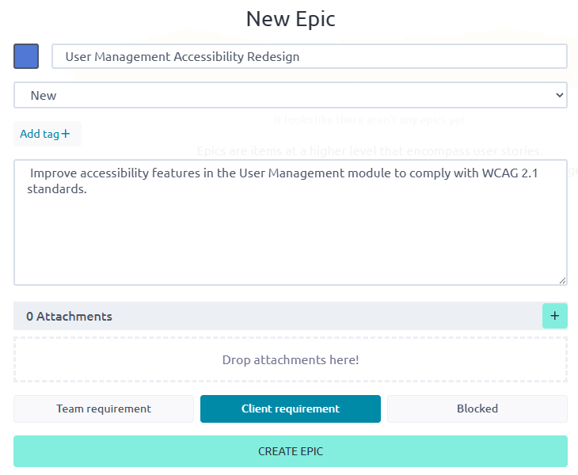

---

|Field             |Description|
|:-----------------|:-----------------------|
|Color ID          |Select a color that identifies the epic.  Alternatively, enter the hexadecimal color code.
|Epic Name      |Enter a unique name for your epic.  For example: _User Management Accessibility Redesign_|
|Epic Description |Enter a description for your epic, which should describe the type of product development for the epic.  For example: _Improve accessibility features in the User Management module to comply with WCAG 2.1 standards._
|Attachments |If desired, upload or drop any relevant attachments, such as feature specs, customer requirements, etc.|
|Team requirement / Client requirement / Blocked| Select one of the following:<ul><li>**Team requirement**: Work defined by user stories in the epic is work the development team feels is necessary but it is not a direct client request.</li><li>**Client requirement**: Work defined by user stories in the epic is the result of a direct client request. .</li><li>**Blocked**: Work defined by the user stories in this epic currently _cannot_ be done, due to an external dependency or issue preventing its progress.</li></ul>

4. Select **Create Epic**.

   The system creates the new epic, and displays it in a new row on the **Epics** screen. 

---

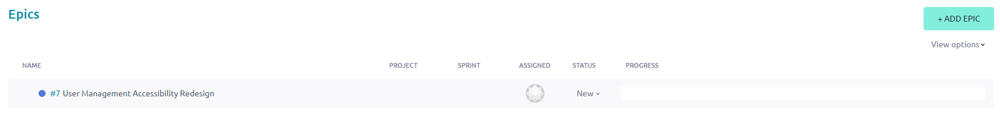

---

|Field             |Description|
|:-----------------|:-----------------------|
|Name          |Name of the epic.
|Project       |Project associated with the epic.  A blank value indicates that the project is the one in which the epic was created (the current project). If the epic was assigned to a project other than the one in which it was created, the name of the project is displayed in this field. |
|Sprint       |Sprint to which the epic is assigned.  **Note**: This field is often blank because epics span multiple sprints. They are _not_ single-sprint items. Instead, epics are linked to their specific user stories or tasks, which get assigned to sprints.|
|Assigned     |Member of the project to which the epic is assigned.  By default, this field is blank. Typically, this is assigned to the specific team member who is responsible for the high-level goal or initiative of the epic.|
|Status       |Status of the epic.  By default, a new epic is set to **New**. Can be set to **New**, **Ready**, **In Progress**, **Ready for Test**, and **Done**.|
|Progress |Calculated rollup that reflects the completion status of all associated user stories (or Kanban cards) linked to the epic.  This is _not_ a manually editable field.

**What to do next?**

[**Create a user story**](#create-a-user-story)

## Create a user story

Create a _user story_ that defines specific development needed to accomplish the goal of the epic.

For example, in the epic called _User Management Accessibility Redesign_, create a user story called _Change UI Labels_, which defines changing the UI text headings to comply with WCAG requirements.

> **Note:** There are two ways to create user stories—from the **Epics** dashboard or from the backlog. To emphasize the value of the project workflow, this procedure describes how to create user stories from the **Epics** dashboard. To create a user story from the backlog, select **Scrum** > **Backlog**, select **+ User Story**, and associate the user story with the relevant epic.

**Before you begin**

[Create an epic](#create-an-epic)

**Procedure**

1. Select the epic for which you want to create a user story.

2. Under **Related user stories**, select the **+** icon.

---

---

3. On the **Create a relationship with** screen, complete the fields.

---

---

|Field             |Description|
|:-----------------|:-----------------------|
|New user story / existing user story| Do one of the following:<ul><li>To create a new story for the epic, select **New user story**.</li><li>To select an existing story for the epic, select **Existing user story**.</li></ul>|
|Which project?     |Select the project with which you want to associate the user story.|
|Subject          |Enter the name of the story.|

4. Select **Save**.

   The system saves the story under **Related user stories** for the epic.

---

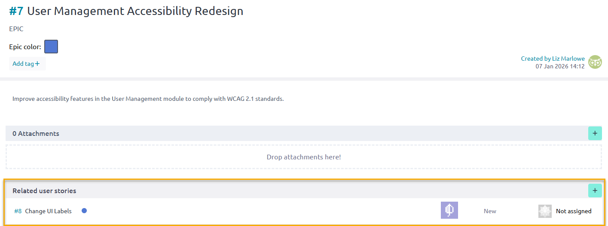

---

5. Now that you created the story, select it again and complete the additional fields.

---

---

|Field             |Description|
|:-----------------|:-----------------------|
|Description       |Enter a description for the story, and select **Save**.  To write the description, use the Connextra template: "As a {user role}, I want to {achieve a goal/action} so that {I get a value or benefit}. For example: _As a user with visual impairments, I want clear and descriptive UI labels so that screen readers can interpret them correctly._|
|Attachments       |Upload any relevant files.  For example, this can include product specs, feature descriptions, etc.|
|Comments          |Enter any relevant comments about the story.  For example, this can include URLs, information about dependencies, potential issues, etc.|
|Points            |Enter the relevant story points for the relevant development areas.  For example, for a UI update, enter points for **UX**, **Design**, and **Front**.|
|Assigned          |Select **+ Add assigned** and select a member from the list. To assign the story to yourself, select **Assign to me**.|
|Watchers          |Select **+ Add watchers** and select the members you want to _watch_ the story. These members will receive email notifications when there are story updates, and when the story's status changes.|

15. To create more stories for the epic, repeat these steps for the additional stories.

**What to do next?**

[Create a task](#create-a-task)

## Create a task

Within each user story, create a _task_, which breaks up story work into smaller, manageable chunks that different members of the team can work on. 

For example, for the user story, _Change UI Labels_, there are 3 tasks: _Propose New UI Labels_, _Update Text Labels in DB_, and _Test New UI Labels_. Each task is assigned to a different member of the team.

**Before you begin**

[Create a user story](#create-a-user-story)

**Procedure**

1. On the **User Story** screen, for **Tasks**, select the **+** icon.

---

---

2. Under **Tasks**, in the new row, do the following:

   1. Enter a name for the task. For example: _Propose new UI labels that meet WCAG guidelines_.

   2. From the drop-down menu next to the name, select the status of the task. By default, the status is **New**. (You can also update the status during the sprint on the sprint task board.)

   3. From the third drop-down menu, select the task, assign it to a member, and select **Add**.

---

---

3. Hover over the row and select **Save**.

---

---

The system saves the new task.

---

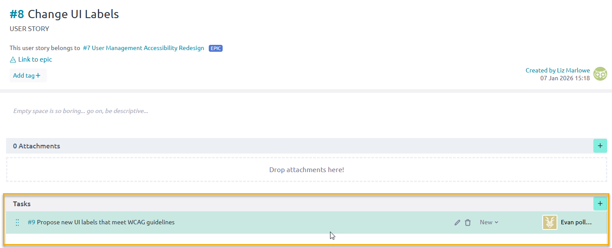

---

4. To create more tasks for the story, repeat these steps for the additional tasks. 

---

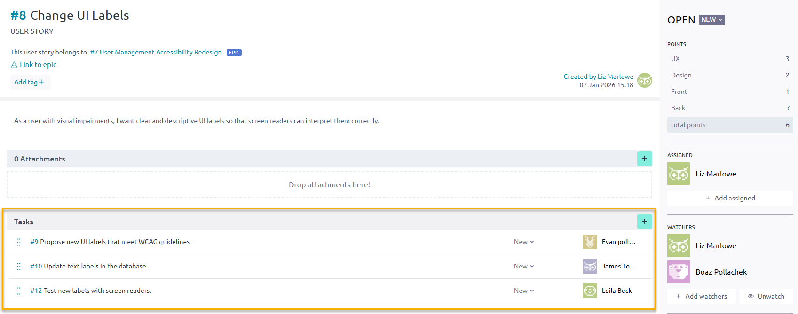

---   

**What to do next?**

[Scrum sprint execution](#scrum-sprint-execution)

# Scrum sprint execution { data-toc-label="Scrum sprint execution" }

During sprint execution, you deliver the work that was prepared during backlog management. This phase includes planning sprints, assigning prioritized user stories to the sprint backlog, and coordinating daily progress. 

Teams work collaboratively to complete stories within the sprint’s timebox, resolve blockers, and track progress using task boards or burndown charts. At the end of the sprint, completed work is reviewed and demonstrated, and the team reflects on improvements during the retrospective.

**Topics**:

* [Create a sprint](#create-a-sprint)
* [Assign user stories to a sprint](#assign-user-stories-to-a-sprint)
* [Track progress and complete user stories](#track-progress-and-complete-user-stories)

## Create a sprint

Create a _sprint_, a timeboxed period for completing user stories. Typically, multiple sprints are created well in advance of their start dates.

**Before you begin**

Complete all steps in [Scrum backlog management](#scrum-backlog-management)

**Procedure**

1. On the project page, from the left sidebar, select **Scrum** and **Backlog**.

   The backlog displays all existing user stories.

---

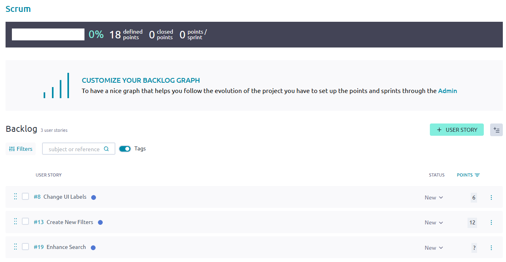

---  

2. From **Sprints**, select **Add +**.

3. On the **New sprint** screen, enter the name of the sprint and the start and end dates, and select **Save**.

---

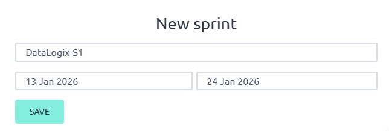

---  

4. Select **Save**.

   Under **Sprints**, the new sprint is now displayed.

---

--- 

**What to do next?**

[Assign user stories to a sprint](#assign-user-stories-to-a-sprint)

## Assign user stories to a sprint

From the backlog, according to deployment priorities, related work, and development dependencies, determine which user stories should be assigned to upcoming sprints, and assign them accordingly.

**Before you begin**

[Create a sprint](#create-a-sprint)

**Procedure**

1. From the **Backlog**, select the user stories you want to move to the sprint you created.

2. Do one of the following:

   - If the sprint to which you want to assign the stories is the latest sprint, select **Move to latest sprint**.

   - Alternatively, drag and drop the selected stories to the sprint you created.

---

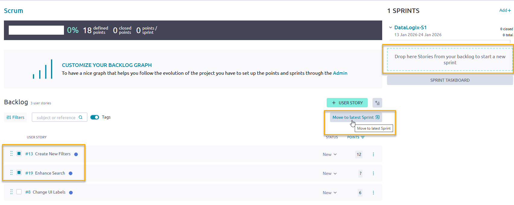

--- 

The stories you selected are now assigned to the sprint.

---

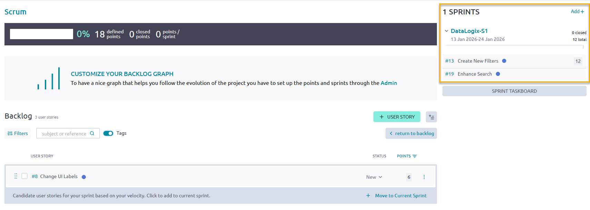

--- 

The application calculates your velocity based on your story points allocated to the sprint. If you can add additional stories to the sprint without exceeding your velocity, the system prompts you to move the candidate user stories to the current sprint.

3. To move candidate user stories to the current sprint, select **Move to Current Sprint**.

   The system updates the assigned stories to the sprint.

**What to do next?**

[Track progress and complete user stories](#track-progress-and-complete-user-stories)

## Track progress and complete user stories

During a sprint, track the status of user stories on the **Sprint Taskboard**. 

During the daily standups, discuss any blockers, issues, and dependencies, and try to resolve them so that members can complete the work defined in the relevant stories. At the end of a sprint, all stories should have a completed status.

**Before you begin**

[Assign user stories to a sprint](#assign-user-stories-to-a-sprint)

**Procedure**

1. From the **Backlog**, select **Sprint Taskboard**.

---

--- 

> 💡 **Tip:** Alternatively, from the left sidebar, select **Scrum > {Sprint Name}**. For example, select **Scrum > DataLogix-S1**.

2. View the Sprint Taskboard.

---

--- 

|Seq. # |Description                                    |
|:------|:----------------------------------------------|
|1      |Sprint name and time frame.                    |
|2      |Sprint status summary, including the number of total story points, completed story points, open tasks, closed tasks, and iocaine doses.  Iocaine doses are a Taiga-specific, playful gamification signal (a _Princess Bride_ reference) that a teammate is taking on a difficult or outside-their-comfort-zone task, and may need extra support or time. See **Iocaine Drinker** in [Manage the team board](#manage-the-team-board). |
|3      |Burndown chart (when selected), which shows the sprint's approximate or projected progress based on estimated closed tasks. |
|4      |Zoom functionality, providing expanded and compact views of the board.                                                                    |
|5      |Filter data (user stories and tasks) by keywords.                                                                                        |
|6      |Assigned user stories in the sprint.|
|7      |Status swim lanes, indicating the status of each task.  Drag and drop tasks to the relevant status lane. When all tasks are in the **Closed** lane, the story is closed.|

3. To display the burndown chart, select the **Show statistics** icon.

   This chart shows your team's progress in a sprint by displaying the remaining work against the time frame in which to complete it. The burndown chart helps identify if you're on track (below ideal line) or falling behind (above ideal line).

---

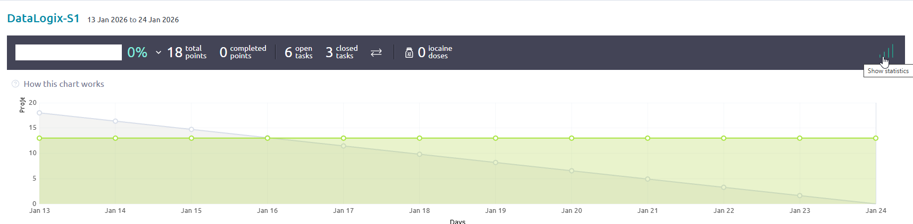

--- 

4. To add additional tasks to a story, select the **+** icon next to the story. You can also add multiple tasks at once using the **bulk task** icon .

---

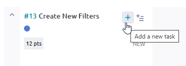

--- 

5. To accurately reflect any blockers and dependencies that arise, create any relevant issues:

   1. From **Sprint Issues**, select the **+** icon.

   2. Enter a description of the issue.

   3. Select **Add Issue**.

      Once an issue is created, you can track its progress, add attachments, assign to a specific member, edit, delete, or detach it from the sprint. For more information on issues, see [Manage issues](#manage-issues).

---

--- 

6. During the daily standups, change the status of tasks as required. At the end of a sprint, all stories should have a completed status.

---

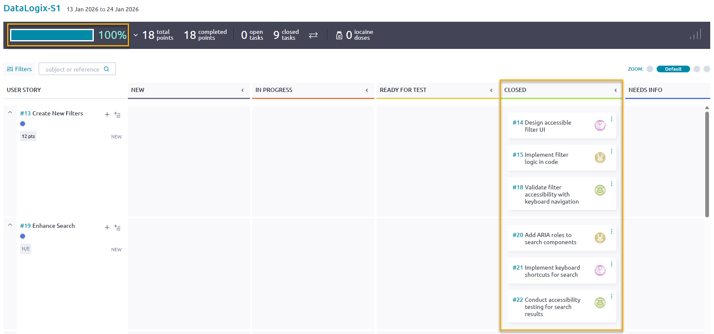

--- 

# Project management beyond Scrum { data-toc-label="Project management beyond scrum" }

Beyond Scrum, Taiga supports other project management methodologies. In addition to organizing work into timeboxed sprints and managing tasks and user stories, you can configure Taiga to use a Kanban board for a higher-level view of project progress. Issues may be tracked independently of sprints, and the Team Board can be utilized for any type of project to display team member roles, skills, and contributions.

**Topics**:

* [Manage a Kanban board](#manage-a-kanban-board)
* [Manage issues](#manage-issues)
* [Manage the team board](#manage-the-team-board)

## Manage a Kanban board

Kanban is a high-level workflow-based Agile software development methodology for managing product development. Using Kanban, work is managed on cards, like virtual index cards or post-it notes, where each card details specific work to be completed. The Kanban board is used to track progress by moving each card from one stage to the next until completion.

**Procedure**

1. From the [Taiga](https://tree.taiga.io/) home page, under **My projects**, select the project you want.

2. On the project page, from the left sidebar, select **Kanban**.

3. To create a new user story for your Kanban project, from any status swim lane, select the **+** icon.  For example, to create a new user story called **Enhance Search**, select the **+** icon from the **New** swim lane.

4. On the **New user story** screen, complete the fields.

---

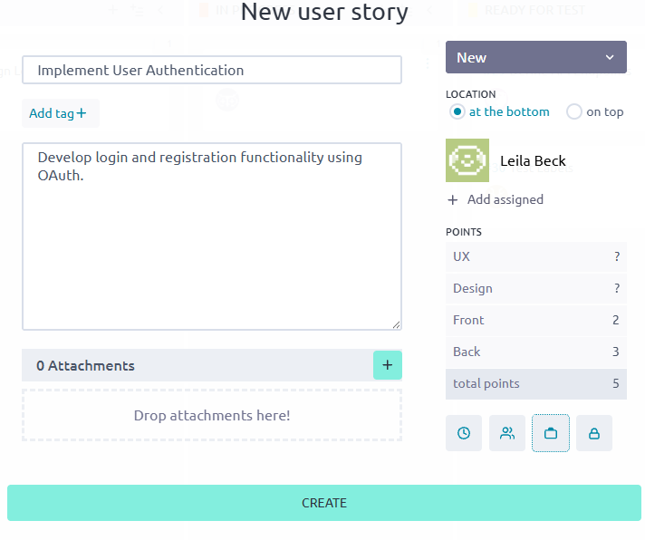

--- 

|Field  |Description                                    |
|:------|:----------------------------------------------|
|Subject |Enter a name for the story.                   |
|Description|Enter the details about the story.        |
|Attachments|Drop any relevant attachments (such as a feature description or development spec).|
|Assign     |To assign the story to a member, select **Assign**, select the member you want. To assign the story to yourself, select **Assign to me**.|
|Points     |Select the area of development you want and enter the number of story points for that area.  For example, for a UI story, enter points for **UX** and **Design**. 

5. Select **Create**.

      The system creates the user story in the relevant status swim lane.

---

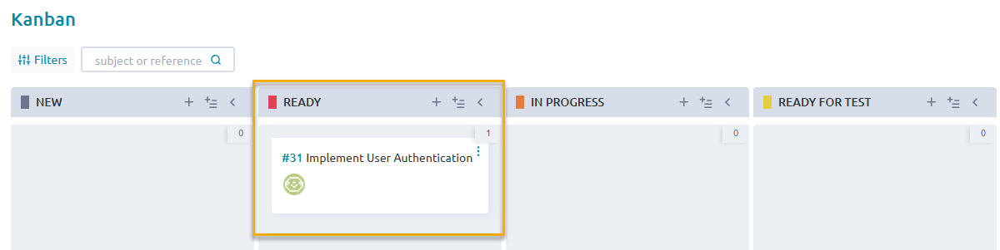

--- 

6. To create multiple user stories in bulk:

   1. From any status swim lane, select the **Add new bulk** icon .

   2. On the **New bulk insert** screen, enter each story name on each line in the text box.

   3. Select **Save**.

     The system creates the user stories in the relevant status swim lanes. 

7. During project status meetings, change the status of stories as required until completion.

---

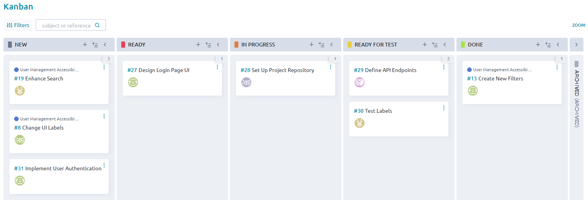

--- 
 
## Manage issues

Every project encounters issues, which may include bugs, questions, dependencies, or required enhancements necessary for completion. In Taiga, issues can be managed independently of Scrum or Kanban boards, allowing you to separate core work items from blockers and ancillary tasks. This approach helps maintain focus on primary deliverables while tracking and resolving obstacles efficiently.

**Procedure**

1. From the [Taiga](https://tree.taiga.io/) home page, under **My projects**, select the project you want.

2. On the project page, from the left sidebar, select **Issues**.

3. To create a new issue, select **+ New Issue**.

4. On the **New issue** screen, complete the fields.

---

--- 

|Field  |Description                                    |
|:------|:----------------------------------------------|
|Subject |Enter a name for the issue.                   |
|Description |Enter the details about the issue.        |
|Attachments |Drop any relevant attachments (such as a Figma screenshot).|
|Assign or Assign to me |To assign the issue to a member, select **Assign** and select the member you want. To assign the issue to yourself, select **Assign to me**.|
|Type            |Select one of the following: <ul><li>**Bug**</li><li>**Question**</li><li>**Enhancement**</li>|
|Severity        |Select one of the following: <ul><li>**Wishlist**</li><li>**Minor**</li><li>**Normal**</li><li>**Important**</li><li>**Critical**</li></ul>|
|Priority        |Select one of the following: <ul><li>**Low**</li><li>**Normal**</li><li>**High**</li></ul>|

5. Select **Create**.

   The new issue appears on the **Issues** page.

---

--- 

4. To create multiple issues in bulk:

   1. Select the  icon.

   2. On the **New bulk insert** screen, enter each issue name on each line in the text box.

   3. Select **Save**.

     The system creates the issues. 

5. To filter existing issues:

   1. Select **Filters**.

   2. Select either **Include** or **Exclude**.

   3. For each attribute (such as **Type**, **Severity**, **Priority**, **Status**, etc.), select the values you want.

---

--- 

6. As needed, change the status of issues as required until completion.

## Manage the team board

In Taiga, the team board can be utilized for any project type to display team member roles, skills, and contributions. It provides a centralized view of the people working on a project, including their roles, assignments, progress, strengths and skills. It helps teams align around shared objectives and manage capacity more effectively.

**Procedure**

1. From the [Taiga](https://tree.taiga.io/) home page, under **My projects**, select the project you want.

2. On the project page, from the left sidebar, select **Team**.

   The system displays the team board, which lists all members in the project, their role, and their titles, which highlight their accomplishments.

---

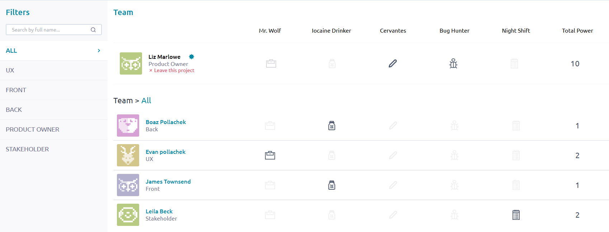

--- 

The following table describes the titles on the team board, which highlight team member skills and contributions.

|Title |Description                                    |
|:------------|:----------------------------------------------|
|Mr. Wolf     |Member who has closed many issues.                   |
|Iocaine Drinker|Member who has ingested many iocaine doses.  A fictional reference to _The Princess Bride_, a member who has ingested many iocaine doses in Taiga indicates that they have tackled difficult or outside-their-comfort-zone tasks. A user can mark an iocaine dose to indicate they’re tackling a difficult or outside‑their‑comfort‑zone task. (Also referenced on the Sprint Taskboard.)|
|Cervantes    |Member who has edited many wiki pages.|
|Bug Hunter   |Member who has reported many issues.    |
|Night Shift |Member who has closed many tasks.      |
|Total Power |Total number of points, or accomplishments, that the member has achieved.|

3. To filter the team members by role, from **Filters**, select the role you want.  For example, to view all UX team members, select **UX**.

---

--- 

4. To view specific details about a team member, select the team member's name.

   The system displays details about the selected team member.

---

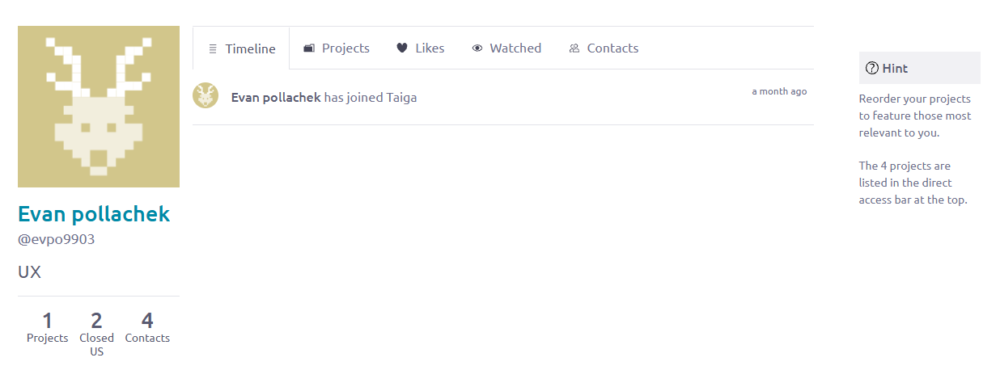

--- 

|Detail       |Description                                    |
|:------------|:----------------------------------------------|
|Projects (Number) |Number of projects with which the team member is associated. |
|Closed US    |Number of user stories the team member has closed.       |
|Contact Count |Number of contacts for the team member.     |
|Timeline     |Date when the team member joined Taiga.     |
|Projects (Tab) |Names of the projects with which the team member is associated. |
|Likes        |Number of likes the team member has on their page. |
|Watched      |Entities that the team member "watches," including projects, epics, stories, tasks, and issues.|
|Contact List |Names of the team member's contacts.

